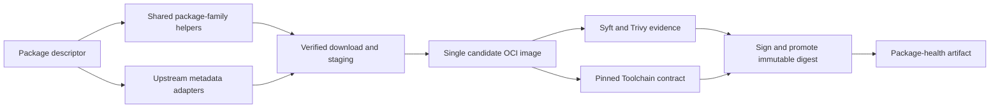

# Architecture

Toolchains turns small PowerShell package descriptors into verified OCI package
images consumed by Toolchain.

- `network.ps1` centralizes browser-compatible HTTP requests, retries, Docker Registry V2 tag discovery, and verified download caching.
- `upstream-metadata.ps1` parses machine-readable or fixture-tested upstream release data.
- `package-families.ps1` implements repeated Node and Adoptium lifecycle behavior.
- `util.ps1` contains remaining package integrity, GitHub, Hugging Face, path, and definition helpers.
- `main.ps1` owns build and publication lifecycle operations.
- `.github/workflows/build-push.yml` separates validation, scanner bootstrap, candidates, protected publication, and health reporting.

Package descriptors should remain declarative and use shared helpers rather
than making direct web requests or duplicating version-family behavior.
